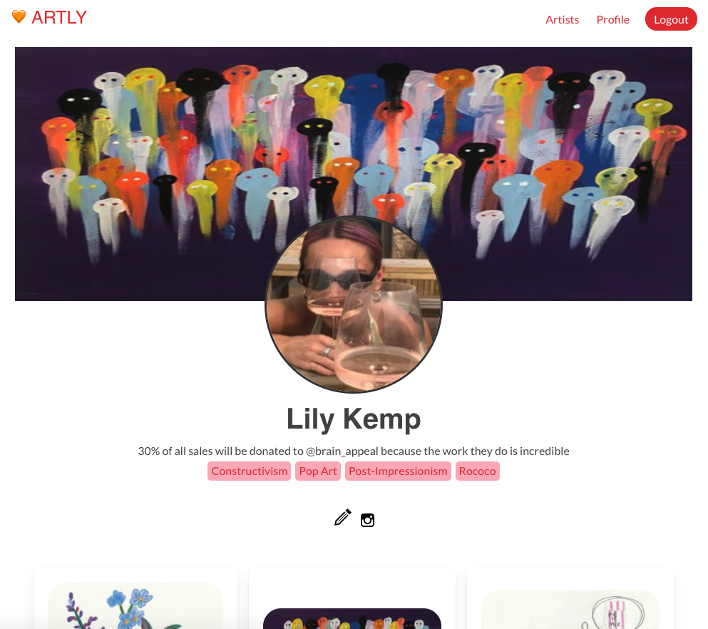
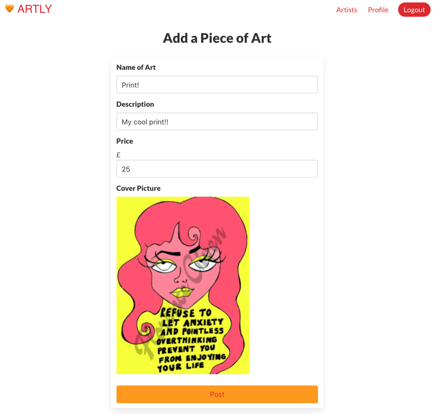
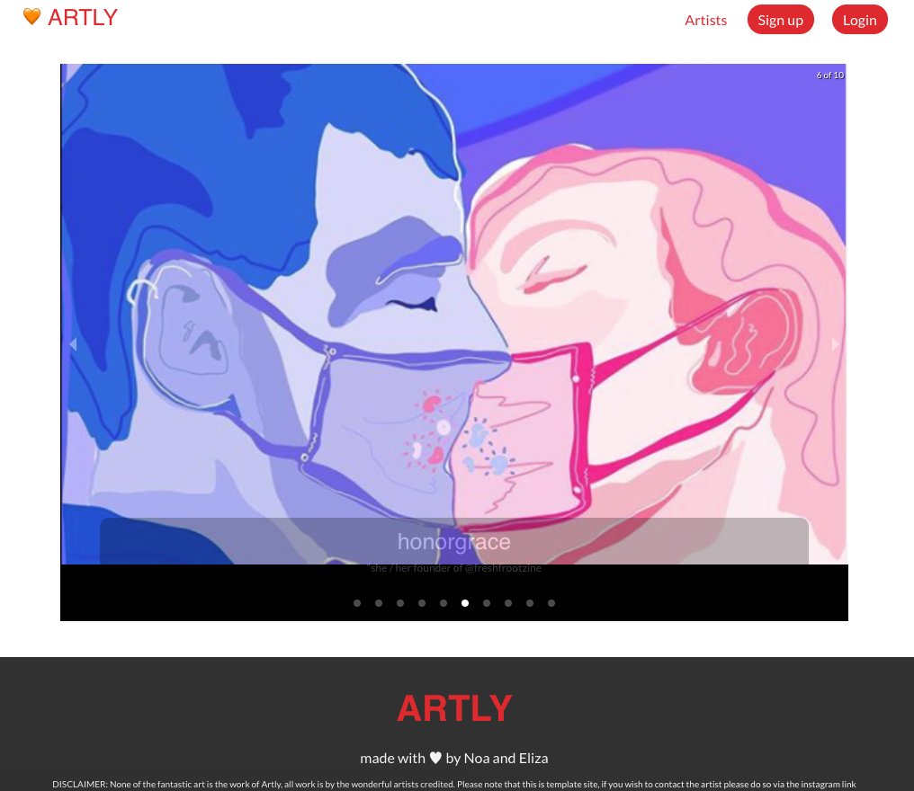
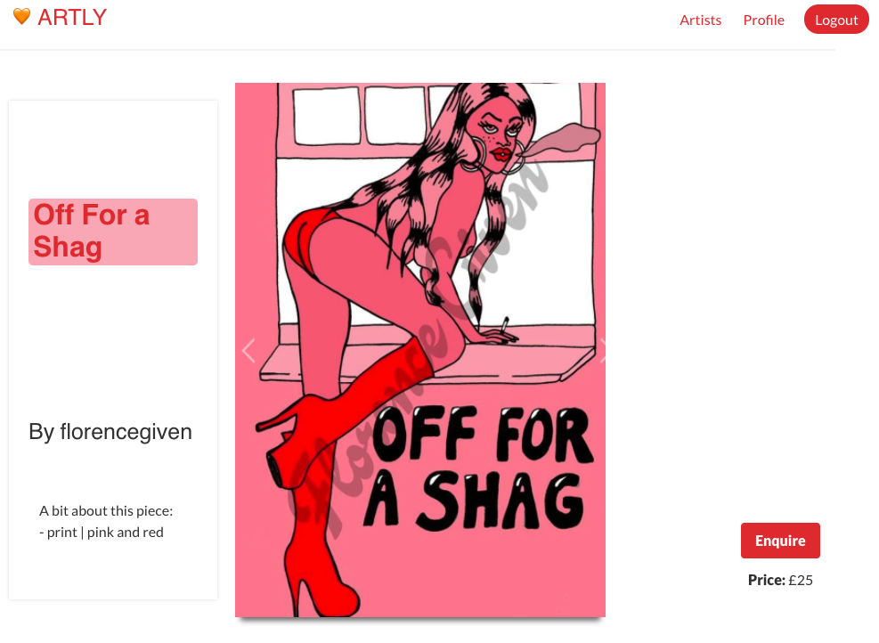
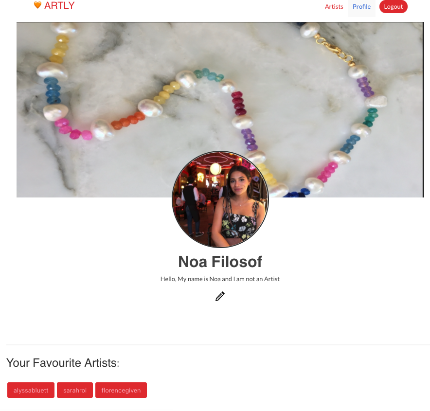
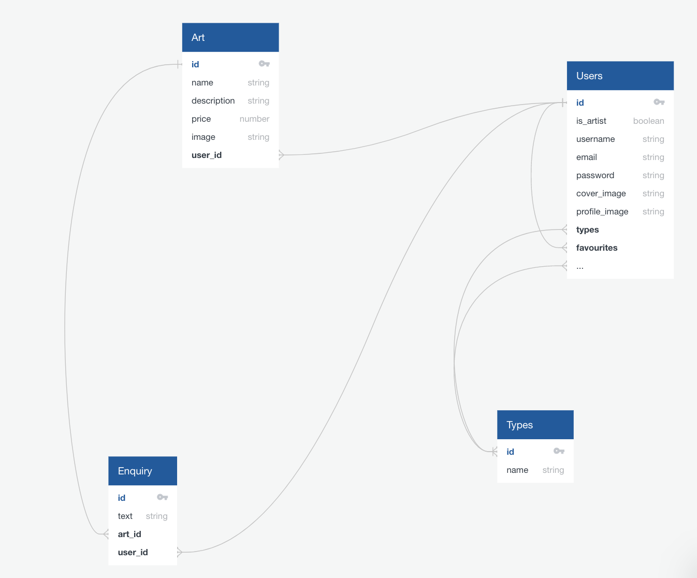
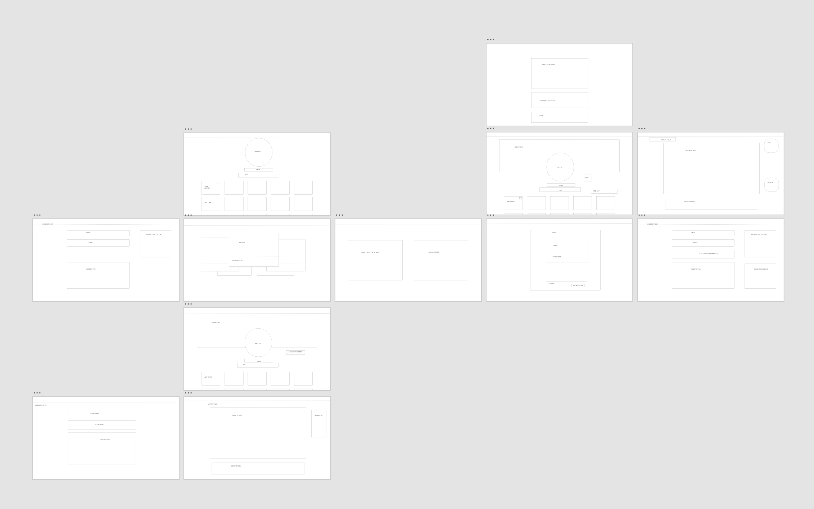
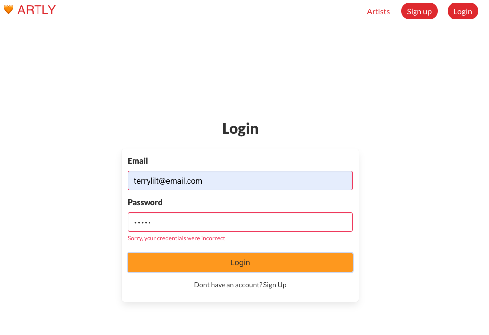

# sei-project-4
## Timeframe
7 days  
2 person pair-coded full-stack project  
Technologies used  
•	JavaScrip | React.js  
•	Mongo.db | Django  
•	CSS | Sass | Bulma  
•	GitHub | TablePlus | Insomnia  
•	Axios | Http Proxy Middleware | Toast | React-Router-Doms | React-Responsive-Carousel  

## Installation
1.	Clone or download the repo
2.	Open the index.html in your browser of choice
  

## Project - Artly

You can find a hosted version here ----> *ADD HOSTED VERSION*
  

## Website Overview

Artly has been curated as a platform to uplift and support small female and non-binary artists. Artly puts art lovers together in one place to share art, support and love. But most importantly, allows you to buy and sell art all in one place! You don’t have to be an artist to take part, just make sure to sign up which will allow you to get in touch with our Artists. If you’re an Artist, make sure to register in order unlock some awesome features of our app such as upload and edit your artwork, links to your socials, and view enquiries on your Art. We hope you love Artly as much as we do.
  

## Website Details

1.	On loading the website takes you to a slash page where you can pick which side of the site you would like to visit. The artist side, where you can create a profile and post art on the website or the Browseing/Shopping side where you can browse artists, favourite them to save them, view their art and enquire about the art.

### Splash

  

2.	Artist Side - If you click to go through to the artist side you are prompted to login (or register), then directed to your profile. On your profile you have a profile picture and a cover photo and can add/display/edit art and link your page to you instagram. Note when you sign up you are asked if you would like to have an artist account or a viewer account and have an artist account allows you post art.
#Login

### Register

### Artist Profile

### Art View as Owner of the art

### Create Art Form

  

3.	Viewer Side - If you click through to the Browsing side of the website, you are directed to a carousel which displays all of the artists on the site to browse. You can then clik on these artist and view their profiles and then their art. Browsers can also make non-artist accounts which unlock features that allow them to and 'favourite' the artist to save them to view again later, enquire about art and have their own profile.
### Carousel

### View an Artist when logged in

### Artist Index Page

### Non artist profile

### Enquiry form

  

4.	The pages such as viewing profiles, or you own profile or view art all vary (what is rendered) depending on if you are logged in, if you are an artist or a viewer and if you own the art.
For example:

### Art View when logged in

### Art view when owner of the Art
 

  

## Process

The starting point for this website was planning our wesite layout and the models for the backend. We made basic wireframes for the layout with AdobeXD and then we created a diagram on 'quick data base diagrams' and layed out the models we would be making with Django.

### Diagram

### Layout

  
We then focused on creating the models in the back end in django, using Insomnia and TablePlus to check our work as we went along. To create the back end we mostly spent our time pair-coding to make sure when you had to refer to the models later on were were both very clear on the terms used and the structures built.
  
Once the Backend was built we turned our attention to building our React.js frontend. We started by creating common elements that would be required by all the pages like the Nabar the home page and the 404 page.
We split up the work load on the front end more, Noa took control of creating the forms and error handling for the forms (there are a lot forms!), and I took on the role of making the profile page/the artist view page and the functionality that entailed. We split up the rest of the front end pretty similarly, jumping and helping each other whenever two brains were required.

### Errors Example:

  
We set up our day in morning stand-up where we outlined what we wanted to achieve that day, and who would take on what task. We often started with the more complex tasks, and pair coded them. Then moving onto tasks which we could complete on our own. We communicated throughout the day (using slack and zoom, as we were working remotely) and ultimately reached our MVP on time, this allowed us to add nice-have-features such as enquiries, favourites and general tidy-up/styling. This also ensured a smooth UX.
  
### Wins
We said at the beginning it would be cool to create a carousel to browse the artist but had never doen anything like it previously, so working together to get that implemented was very rewarding.
  

### Challenges
The Carousel.
Designing the flow of the site.
Arranging the profile picture and cover photo.
  

### Future features
Building full chat capabilities with notifications, not just one way enquiries.
eCommerce features.
Adding a calendar feature where artists can display gallery showings and events.
Allowing artist to create more personalised types which allows users to be able to search artists by these types.
